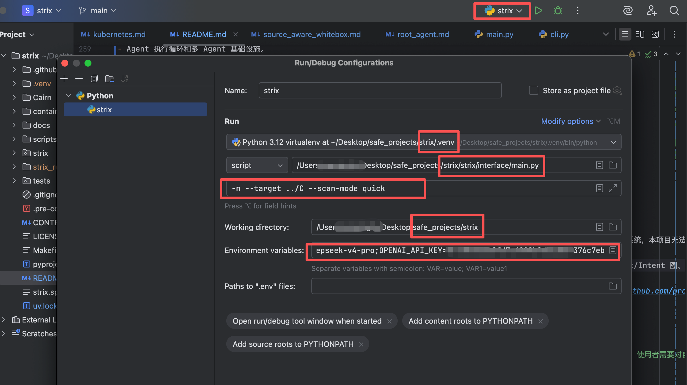

# Strix 二次开发版

面向中国国内使用环境、引入 Cairn 状态图搜索思想的 AI 安全测试系统。

本项目基于开源项目 [usestrix/strix](https://github.com/usestrix/strix) 开发。它保留了 Strix 原有的 Agent、共享沙箱、安全工具、漏洞验证和报告能力，并重点改造了模型接入方式与黑盒渗透测试流程。

> [!IMPORTANT]
> 本仓库不是 Strix 官方发行版。项目仅用于获得明确授权的安全测试、教学研究和受控靶场。

## 为什么进行二次开发

原版 Strix 已经提供了完整的 AI 安全测试基础设施，但在中国国内环境和长时间黑盒渗透测试中，仍有一些值得改进的地方。

### 更适合中国国内的模型接入

原版 Strix 主要围绕海外模型服务设计。国内用户面临网络访问、接口配置、调用稳定性和使用成本等问题。

本项目增加并优化了国内常用模型服务的直接接入：

- **阿里云百炼 / 通义千问 Qwen**：自动使用 DashScope OpenAI 兼容接口。
- **DeepSeek**：自动使用 DeepSeek 官方 OpenAI 兼容接口，并适配推理参数。
- **中文 CLI、提示信息与文档**：降低国内用户的配置和使用门槛。
- **保留 LiteLLM 兼容能力**：仍可继续使用 OpenAI、Anthropic、Gemini、Ollama 等模型。

模型名称、API Key 和 Base URL 会根据提供方自动解析，不需要手动拼装复杂的 LiteLLM 配置。

### 改进黑盒渗透测试的长期协作能力

原版 Strix 的黑盒流程主要依赖 Root Agent：

```text
Root Agent 侦察与规划
→ 创建专项子 Agent
→ 子 Agent 发现、验证和报告
→ 结果通过消息返回 Root Agent
```

这种方式直观、灵活，但在目标复杂、任务并行或扫描持续时间较长时容易出现：

- 重要发现散落在不同 Agent 上下文中。
- Root Agent 上下文不断增长，规划质量逐渐下降。
- Agent 之间可能重复测试相同方向。
- 难以判断攻击面覆盖是否完整。
- 扫描中断后难以从原状态继续。
- Agent 委派图只能说明“谁创建了谁”，不能完整表达“基于什么事实，为什么进行这次探索”。

因此，本项目使用 Cairn 的状态图搜索思想，重构了纯黑盒 Web/IP 渗透测试流程。

## Cairn 带来的灵感

[Cairn](https://github.com/oritera/Cairn) 将渗透测试视为一个从已知起点走向目标的状态空间搜索问题。

它没有为 Agent 预设固定角色，而是围绕三种核心信息协作：

- **Fact**：已经确认的客观事实。
- **Intent**：基于现有事实提出的下一步探索方向。
- **Hint**：用户或系统提供的策略信息。

每次探索都从已有 Fact 出发，执行一个 Intent，再产生新的 Fact：

```text
发现登录接口（Fact）
→ 测试认证逻辑（Intent）
→ 发现可疑会话行为（Fact）
→ 独立验证会话漏洞（Intent）
→ 漏洞验证成立（Fact）
```

这种方法使中间结果成为可共享、可恢复、可审计的系统状态，而不是只存在于某个 Agent 的对话历史中。

本项目没有直接嵌入 Cairn Server、Dispatcher 或 Worker 容器，而是在 Strix 内实现轻量状态图控制面。这样可以复用 Strix 已有能力，同时吸收 Cairn 最有价值的设计思想。

## 修改后的黑盒架构

当全部目标均为 `web_application` 或 `ip_address`，且没有提供源码时，系统自动进入新的状态图黑盒流程：

```text
目标输入
→ 初始化 Fact / Intent 状态图
→ 专项 Agent 执行 Recon、Discovery 或 Validation Intent
→ 执行结论写回 Fact
→ Reason Agent 读取完整状态图并规划下一批 Intent
→ 满足覆盖门槛且 Reason Agent 确认完成
→ 生成最终渗透测试报告
```

白盒扫描以及同时包含源码和在线目标的混合扫描，继续使用 Strix 原有流程。

### 程序与 Agent 的职责边界

程序控制面负责：

- Intent 去重、认领、释放、失败重试和并发调度。
- 校验任务是否超出授权目标范围。
- 保存 Fact、Intent、覆盖状态和因果关系。
- 根据 `quick`、`standard`、`deep` 扫描模式检查覆盖门槛。
- 持久化扫描状态并支持中断恢复。
- 限制不同类型 Agent 可以调用的工具。

Agent 负责：

- **Reason Agent**：只读取状态图、提出新 Intent 或判断是否完成。
- **Recon / Discovery Agent**：执行单一侦察或漏洞发现任务。
- **Validation Agent**：独立验证候选漏洞与 PoC。
- **Reporting Agent**：仅在验证成功后创建正式漏洞报告。

Reason Agent 不能执行扫描工具；普通图 Worker 不能创建子 Agent或直接提交漏洞报告。关键流程由程序约束，而不是只依赖 Prompt。

### 状态图持久化

每次黑盒扫描都会生成：

```text
strix_runs/<run-name>/state_graph/events.jsonl
strix_runs/<run-name>/state_graph/snapshot.json
strix_runs/<run-name>/state_graph/graph.yaml
```

- `events.jsonl`：状态变更事件，是恢复执行的主要依据。
- `snapshot.json`：当前状态快照，用于快速读取。
- `graph.yaml`：便于人工查看和审计的完整状态图。

中断后可以继续运行：

```bash
strix --resume <run-name>
```

恢复时，未完成 Intent 会重新进入调度队列；已经完成的探索和漏洞报告不会重复执行。

## 核心能力

- 完整 HTTP 代理、浏览器自动化、终端和 Python 运行时。
- 子域名、端口、服务、目录、接口和参数枚举。
- 针对访问控制、认证、注入、SSRF、XXE、RCE、文件处理和业务逻辑的专项测试。
- 候选漏洞独立验证与 PoC 确认。
- 漏洞去重、CVSS 评估和最终报告。
- 基于 Fact/Intent 的黑盒状态图搜索。
- 按扫描模式执行确定性覆盖检查。
- 扫描状态持久化、中断恢复和完整探索路径审计。

## 快速开始

### 前置条件

- Python 3.12 或更高版本
- 正在运行的 Docker
- 可用的大语言模型 API Key

### 安装

```bash
uv sync
```

### 使用通义千问 Qwen

```bash
export STRIX_LLM="qwen3.7-max"
export DASHSCOPE_API_KEY="your-dashscope-api-key"

uv run strix --target https://your-app.example
```

默认使用：

```text
https://dashscope.aliyuncs.com/compatible-mode/v1
```

如需覆盖接口地址：

```bash
export DASHSCOPE_API_BASE="your-dashscope-compatible-base-url"
```

### 使用 DeepSeek

```bash
export STRIX_LLM="deepseek-v4-pro"
export DEEPSEEK_API_KEY="your-deepseek-api-key"

uv run strix --target https://your-app.example
```

默认使用：

```text
https://api.deepseek.com
```

如需覆盖接口地址：

```bash
export DEEPSEEK_API_BASE="your-deepseek-compatible-base-url"
```

### 使用其他模型

```bash
export STRIX_LLM="openai/gpt-5.4"
export LLM_API_KEY="your-api-key"

uv run strix --target https://your-app.example
```

本项目继续兼容 LiteLLM 支持的模型提供方和本地模型。

## 使用示例

```bash
进入项目根目录，运行如下代码：
# Web 应用黑盒渗透测试：自动使用状态图流程
uv run strix --target https://your-app.example

# IP 黑盒渗透测试：自动使用状态图流程
uv run strix --target 192.0.2.10

# Web + IP 多目标黑盒测试
uv run strix \
  --target https://your-app.example \
  --target 192.0.2.10 \
  --scan-mode standard

# 指定测试重点
uv run strix \
  --target https://your-app.example \
  --instruction "重点检查认证、越权和业务逻辑漏洞"

# 非交互模式
uv run strix -n --target https://your-app.example

# 恢复中断的黑盒扫描
uv run strix --resume <run-name>

# 本地源码白盒扫描：继续使用原版 Strix 流程
uv run strix --target ./app-directory

# 源码与在线目标混合扫描：继续使用原版 Strix 流程
uv run strix \
  --target ./app-directory \
  --target https://your-app.example
```

## 扫描模式

| 模式 | 目标 |
| --- | --- |
| `quick` | 快速覆盖关键入口、认证、访问控制与注入风险 |
| `standard` | 平衡覆盖范围与验证深度，适合常规安全评估 |
| `deep` | 深入枚举、状态转换、协议特性与攻击链探索 |

状态图流程只有在满足对应模式的覆盖门槛，并且 Reason Agent 明确确认没有剩余高价值方向后，才允许完成扫描。

## 调试模式


使用 Pycharm 打断点，对项目进入如下配置，后点击 `Debug` 按钮启动调试。

- 新建一个 Python Run/Debug Configuration 
- 选择你的项目解释器，最好是这个仓库的 .venv 
- Module name 填：strix.interface.main 
- Parameters 填：-n --target ./your-project --scan-mode quick 
- Working directory 设为仓库根目录：xxxx/safe_projects/strix 
- 环境变量按你要用的模型填，比如 deepseek：STRIX_LLM=deepseek-v4-pro;OPENAI_API_KEY=sk-xxxx 
- 然后直接点 Debug，断点就能进。

## 说明

本项目尊重并持续受益于原版 Strix 的设计与实现：

- Agent 执行循环和多 Agent 基础设施。
- Docker 共享沙箱与安全测试工具。
- 技能与漏洞测试 Playbook。
- 漏洞验证、去重、报告和 CLI/TUI。
- 白盒与混合扫描流程。

本项目的主要新增内容：

- DeepSeek 与通义千问 Qwen 的国内接口适配。
- 中文使用体验。
- 基于 Cairn 思想的黑盒 Fact/Intent 状态图。
- 程序化黑盒调度、覆盖门槛、工具权限和恢复能力。

## 致谢

首先感谢 [usestrix/strix](https://github.com/usestrix/strix) 项目及其维护者。没有 Strix 提供的 Agent、安全工具、沙箱和报告系统，本项目无法快速完成这些探索。

特别感谢 [oritera/Cairn](https://github.com/oritera/Cairn)。本项目黑盒渗透测试流程的核心思路，直接受到 Cairn 的黑板架构、Fact/Intent 图、状态空间搜索和间接协作思想启发。

同时感谢 [LiteLLM](https://github.com/BerriAI/litellm)、[Caido](https://github.com/caido/caido)、[Nuclei](https://github.com/projectdiscovery/nuclei)、[Playwright](https://github.com/microsoft/playwright) 和 [Textual](https://github.com/Textualize/textual) 等开源项目。

## 安全与授权

> [!WARNING]
> 只允许测试你拥有或已经获得明确授权的应用、域名、IP 和系统。未经授权的扫描、漏洞验证、利用或数据访问可能违法，并可能对目标造成实际损害。使用者需要对自己的行为承担全部责任。
